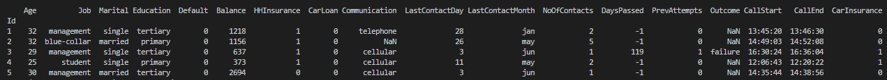

# Kaggle - Car Insurance Data Analysis and Models

## Contents
1. Explatory Data Analysis
- Dataframe: shape, columns, description, dtypes 
- Null/Outlier check 
- Visualisation/plots
- Feature engineering
2. Model Selection
- Baseline Model
- XGBoost Model
- Setup the environment
3. Automated Tests
##

**1. Explatory Data Analysis (EDA)**

EDA consists of couple of steps such as checking raw dataframe, handling null (NaN) or outliers, retrieving correlation values between columns and CarInsurance, investigating plots for more explanations, and feature engineering. 

**DataFrame:**

Exploration of the dataset, including a snapshot of the dataset, datatypes of each column, statistics behind each column is needed before going deeper into the data processing and feature engineering steps. 

Our dataset has 18 columns of which 8 columns are *object* datatype (i.e. string or mixed), and the rest are *int64* datatype. 

    

    

**Outlier check**:

According to Balance and PrevAttempts boxplots below, we can see that values are distributed homogenously, but one particular data point is far from other data points. So, that data point (maximum number in columns) is dropped from the dataset not to create any noise. As can be seen, there is no obvious outlier in CallDuration and DaysPassed columns. 

    
    

    
    

**Missing data:**

As one of biggest problem inherent in datasets, tackling with missing data is important task for the predictive model. Even though some models such as XGBoost classifiers can handle missing data, others like RandomForest classifier or Neural Networks are sensitive to having missing data. Hence, we need to impute them before building the models. 

In our dataset, Job, Education, Communication, and Outcome columns have missing values. While Job and Education have considerable amount of missing data (0.4% and 4.3%, respectively), there are significant number of missing value in Communication and Outcome (22.5% and 76%, respectively).

Steps followed:
1. Assign "No Campaign" in *Outcome* to the rows with *DaysPassed = -1*
2. Fill remaining NA in *Outcome* with None
3. Fill NA in *Communication* with None
4. Fill NA in *Education* and *Job* with the most frequent value 

    

**Visualisation/plots:**

**2. Model Selection**

**Baseline Model**

**XGBoost Model**

**Neural Network Model**

## Setup the environment

Python requirement: > Python3.7.5
 $ pip install -r requirements.txt

**4 Automated Tests**

Filepath to run model tests: kaggle-car-insurance/
 $ python -m unittest discover -s tests -p test_models.py -t ..
